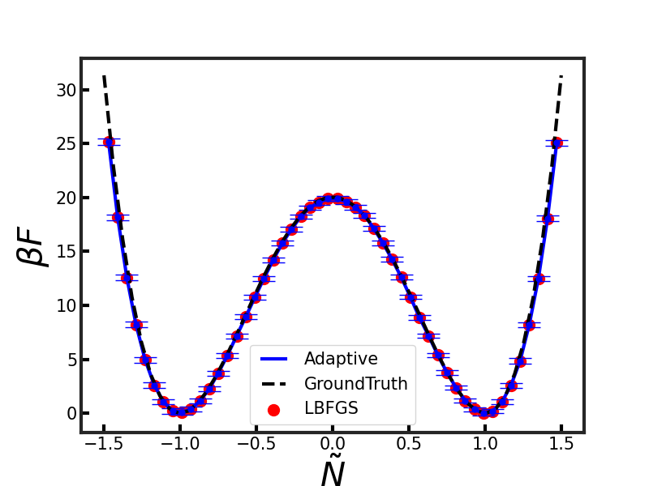
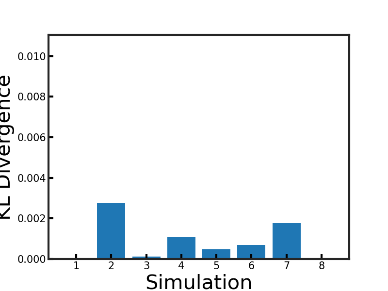
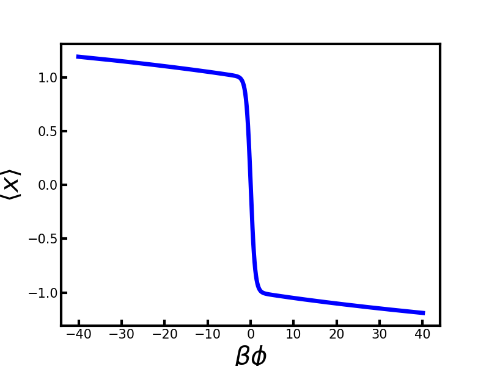

# Wham_cpp

[](https://github.com/Yusheng-cai/Wham_cpp/actions/workflows/build.yml)
[](LICENSE)

`Wham_cpp` is a C++ implementation of the Weighted Histogram Analysis Method
(WHAM) for reconstructing free-energy surfaces from biased molecular simulation
data.

The code supports binned and unbinned WHAM workflows, multiple optimization
strategies, reweighting calculations, and validation against bundled reference
outputs.

## Features

- Unbinned WHAM (UWHAM) with adaptive and L-BFGS optimization strategies.
- Binned WHAM (BWHAM) support for histogram-based analysis.
- Reweighting utilities for evaluating free energies under modified potentials.
- OpenMP-enabled execution paths for thread-level parallelism.
- CMake build system with an official CTest validation suite.

## Repository Layout

| Path | Purpose |
| --- | --- |
| `src/` | WHAM implementations, bias models, reweighting, and time-series operations. |
| `tools/` | Input parsing, command-line handling, filesystem helpers, and shared utilities. |
| `parallel/` | OpenMP and MPI-related helper code. |
| `test/` | CTest wiring, shell test runner, fixtures, and golden reference outputs. |
| `scripts/` | Example WHAM input files. |
| `Eigen/`, `LBFGS/` | Vendored numerical dependencies. |

## Requirements

- CMake 3.18 or newer
- A C++14 compiler
- OpenMP
- FFTW3
- Bash, for the registered CTest runner
- Python 3, for input-generation utilities and their tests

On Ubuntu, the system dependencies can be installed with:

```bash
sudo apt-get update
sudo apt-get install --yes cmake g++ libfftw3-dev python3
```

## Build

Use an out-of-source build:

```bash
cmake -S . -B build -DCMAKE_BUILD_TYPE=Release
cmake --build build --parallel
```

The executable is written to:

```bash
build/bin/Wham
```

## Test

Run the registered CTest suite:

```bash
ctest --test-dir build --output-on-failure
```

The official suite currently validates the adaptive and L-BFGS UWHAM paths with
`OMP_NUM_THREADS=1`, `4`, and `8`, plus focused unit coverage for shared WHAM
helpers and core utilities.

## Usage

The executable expects the WHAM input file as the first positional argument.
When time-series paths in the input file are relative to a separate data
directory, pass that directory with `-abspath`.

```bash
build/bin/Wham <input.dat> [-abspath <time-series-directory>]
```

For example, to run the adaptive validation input against the bundled 1D model
potential data:

```bash
build/bin/Wham test/testAdaptive/input.dat -abspath test/testdata/ModelPotential1d
```

Output files are selected by each input file through the `outputs` and
`outputFile` entries.

## Input Generation

For common umbrella-sampling workflows, use the structured input generator to
create native WHAM `.dat` files from a compact JSON spec:

```bash
python3 tools/generate_wham_input.py examples/input_specs/uwham_1d.json -o input.dat
```

See [docs/input-format.md](docs/input-format.md) for the JSON schema, native
template, and examples.

## Documentation

- [Input format and generator](docs/input-format.md)
- [WHAM methods and options](docs/wham-methods.md)
- [Build and test guide](docs/build-and-test.md)

## Example Inputs

- `examples/input_specs/uwham_1d.json`: compact 1D UWHAM generator input.
- `examples/templates/uwham_1d.dat`: native 1D UWHAM copy/edit template.
- `scripts/inputBwham.dat`: BWHAM example using L-BFGS.

## Validation

### Free Energy

The bundled validation cases compare UWHAM free-energy estimates from adaptive
and L-BFGS optimization strategies. Bootstrap analysis is used to estimate
uncertainty in the reconstructed free energy.



### KL Divergence

The validation workflow also evaluates KL divergence across the biased
simulations.



### Reweighting

The reweighting examples evaluate free energies in a modified ensemble by
adding a target potential to the equilibrium free energy.



## Continuous Integration and Delivery

Continuous integration (CI) automatically builds and tests the project when code
changes. This repository uses GitHub Actions to configure CMake, compile the
`Wham` executable, and run the registered CTest suite on pushes and pull
requests.

Continuous delivery or deployment (CD) takes a passing build and publishes
something, such as release artifacts, packages, documentation, or a deployment.
This repository does not publish release artifacts automatically yet; CD can be
added once versioning and release packaging are defined.

## References

1. Shirts, Michael R., and John D. Chodera. "Statistically optimal analysis of
   samples from multiple equilibrium states." *The Journal of Chemical Physics*
   129, 124105 (2008). <https://doi.org/10.1063/1.2978177>
2. A. J. Patel, P. Varilly, D. Chandler, and S. Garde. "Quantifying Density
   Fluctuations in Volumes of All Shapes and Sizes using Indirect Umbrella
   Sampling." *Journal of Statistical Physics* 145, 265 (2011).
3. A. J. Patel, P. Varilly, and D. Chandler. "Fluctuations of Water Near
   Extended Hydrophobic and Hydrophilic Surfaces." *Journal of Physical
   Chemistry B* 114, 1632 (2010).

## License

This project is distributed under the MIT License. See [LICENSE](LICENSE).
